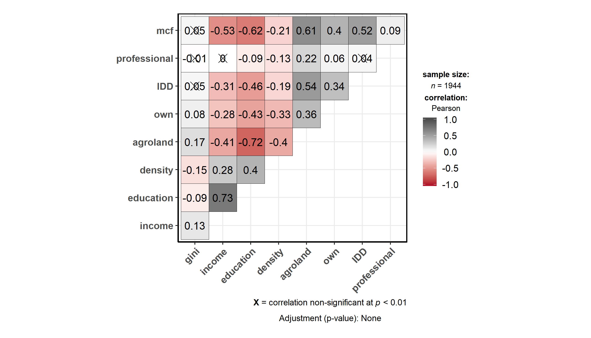

```{r xaringan-themer, include = FALSE}
# library(xaringanthemer)
# mono_accent(base_color = "#252525", link_color	= "rgb(198, 219, 239)")
```

<style>
.onehundredtwenty {
  font-size: 120%;
   }

<style>
.ninety {
  font-size: 90%;
   }

.eightyfive {
  font-size: 85%;
   }
   
.eighty {
  font-size: 80%;
   }
   
.seventyfive {
  font-size: 75%;
   }
   
.seventy {
  font-size: 70%;
   }
</style>


```{r setup, echo = F, include=F}
# include=FALSE
options(htmltools.dir.version = FALSE)

pacman::p_load(tidyverse, xaringan)

knitr::opts_chunk$set(echo = F, warning = F, error = F, message = F)

```


<br>
<br>
<br>
<br>
<br>
<br>
<br>
<br>

.onehundredtwenty[

Research Question:

> What role does income inequality play in explaining differences in municipal efficiency? 

]


---

class: inverse, center, middle

# What do we know about the Link between <br> 

# (Local Government) Efficiency <br> and <br> Income Inequality? 

---

### Trade-off between efficiency and equity:

--

+ Pursuing equality can reduce efficiency (see Okun 1975; Browning & Johnson 1984; Andersen & Maibom 2016)   

--

+ But, equality could also be an important ingredient in promoting and sustaining growth (see Berg & Ostry 2011; kumhof, Rancière & Winant 2015)

--

### Local Government Efficiency (LGE): The interest has been on:

--

.pull-left[
#### Measuring LGE

+ Parametric (SFA) vs non-parametric (DEA) measurement techniques 
+ Provision of single services vs overall efficiency
+ Selection of inputs and outputs (outcomes)
+ Input oriented vs output oriented approach
]

--
.pull-right[
#### Explaining differences in LGE

+ Discretionary factors (associated with the measurement process)

+ Non-discretionary (contextual) factors
  + Economic - Financial
  + Social - Demographic - Geographic
  + Political - Institutional
]
---

## Hypotheses

### About the level of inefficiency of Chilean municipalities

> Chilean municipalities show an average level of inefficiency of 30%.

.right[
<i>See Pacheco, Sanchez & Villena, 2013</i>
]

--

### About the relationship between LGE and income inequality 

> $H_0$: Higher income inequality could negatively affect municipal efficiency.

.right[
<i>See Tandon ,2005; Jottier, Ashworth, & Heyndels, 2012; Ortega, Sanjuán, & Casquero, 2017</i>]

--

> $H_1$: Income inequality does not have a significant association with municipal efficiency

---

class: inverse, center, middle


## Data & Methodology


---

## Data

--

- Sample of 324 municipalities

--

### Inputs - Output Data used to measure LGE  

--

+ National System of Municipal Information, SINIM (2006-2017)
+ In total 3888 observations

--

### County-Level Data on Contextual Factors

--

+ National Socioeconomic Characterization Survey, CASEN (2006 - 2009 - 2011 - 2013 - 2015 - 2017)  
+ SINIM
+ "Servicio de Impuestos Internos", SII
+ National Institute of statistics, INE
+ in total 1944 observations

---

## Methodology: Two Stage Approach

--

### First Stage: DEA analysis

--

+ Input oriented assuming variable returns to scale
+ Result: A vector of **efficiency scores (ES)** for each municipality

--

### Second Stage: Regression Analysis

--

+  **Dependent variable**: DEA efficiency scores 

--

+ **Independent variables**: 
  + Measure of Income inequality + Remaining contextual factors
  + County (zone) specific + time effects

--

+ **Estimation method**: Censored regression + Instrumental Variable (IV)

--

+ **Proposed Instrument**: 

$$pss\_firms = \frac{\text{Number of firms in primary sector}}{\text{Total number of firms}}$$

---

## Inputs and Outputs used in DEA: Summary Statistics

--

+ All monetary data is in Chilean pesos of 2017

--

+ All indicators in per capita terms

--

<center>

</center>

---

## Correlation Matrix Numeric Contextual Factors

<center>

</center>

---

class: inverse, center, middle


# Analysis & Results

---

class: inverse, center, middle


# First Stage: 

<br>

#DEA

---
class: center
### Chile: Geographic and Regional Administrative Division 

<center>

</center>

---
class: center

## Results: Returns to Scale by Zone

<center>

</center>

---
class: center

## Efficiency Scores by Zone and Region 

.pull-left[

]

.pull-right[

]

---
class: center

## Evolution Efficiency Scores by Zone (Full Period) 

<center>

</center>

---

class: inverse, center, middle


# Second Stage: 

<br>

# Regression Analysis

---
class: center

### Model Comparisons - Censored Cross-sectional regressions

<center>

</center>

---
class: center

### Model Comparisons - Panel Data
<center>

</center>

---

class: inverse, center, middle

# Conclusions & Future Research

---

## Conclusions

--

### DEA

--

+ The "production function" of municipalities can be described by one showing variable returns to scale.
+ About 3/4 of municipalities shows some degree of ineficiency.
+ The average level of inefficiency is 17%, with higher levels in the Centre area of the country and lower levels in the South.
+ Efficiency shows a ciclical behaviour and, on average, has remained stable in the period 2006 - 2017.

--

### Regression analysis

--

> This paper offers empirical **evidence of a negative relationship
between inequality and efficiency**, that is, a reduction of income inequality (or an increase in equality) could have positive effects on economic efficiency, at least at the level of local governments.


---
class: inverse, center, middle

# Limitations and Future Research

---

## Limitations

--

- Results sensitive to the selection and number of inputs and outputs (External validity)

--

- Associated with observational data and causal inference

--

## Future research

--

- Program evaluation in Chilean municipalities (for instance, assigning municipalities to "treatment" using as running variable county population or the level of income percapita)

--

- Given the current situation of the country: What about the issue of **reverse causality?**

---

class: inverse, center, middle


## Thanks for Listening!

---
class:center
### Appendix 1: Inputs and Outputs for DEA

<center>

</center>

---
class:center
### Appendix 2: Contextual factors

<center>

</center>
