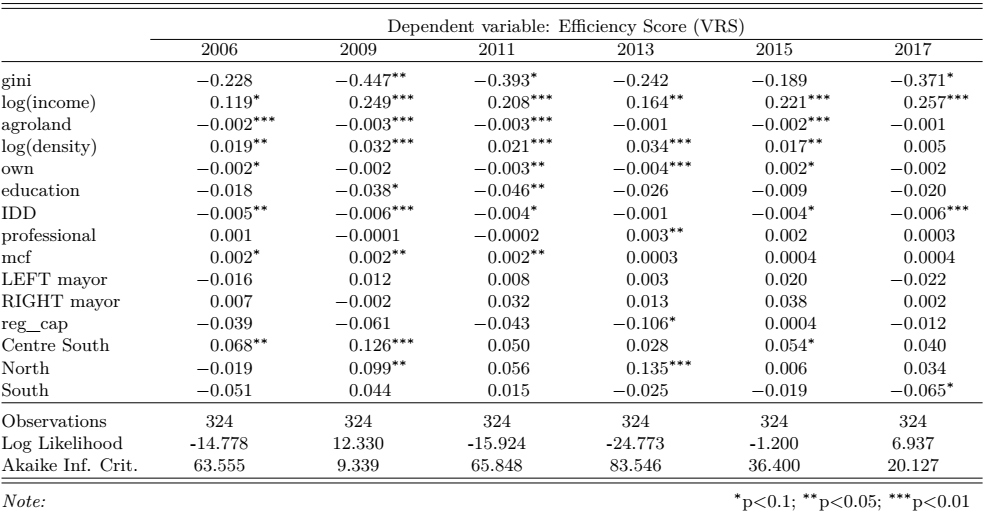

```{r xaringan-themer, include = FALSE}
# library(xaringanthemer)
# mono_accent(base_color = "#252525", link_color	= "rgb(198, 219, 239)")
```

<style>
.onehundredtwenty {
  font-size: 120%;
   }

<style>
.ninety {
  font-size: 90%;
   }

.eightyfive {
  font-size: 85%;
   }
   
.eighty {
  font-size: 80%;
   }
   
.seventyfive {
  font-size: 75%;
   }
   
.seventy {
  font-size: 70%;
   }
</style>


```{r setup, echo = F, include=F}
# include=FALSE
options(htmltools.dir.version = FALSE)

pacman::p_load(tidyverse, xaringan)

knitr::opts_chunk$set(echo = F, warning = F, error = F, message = F)

```


<br>
<br>
<br>
<br>
<br>
<br>
<br>
<br>

.onehundredtwenty[

Research Question:

> What role does income inequality play in explaining differences in municipal efficiency? 

]


---

class: inverse, center, middle

# Theoretical Link between <br> <br> 

## (Local Government) Efficiency <br> and <br> Income Inequality 

---

### Theory

> Pursuing equality can reduce efficiency (the total output produced with given resources).

.center[
<i> See Okun (1975) </i> 
]

--

+ Consequences of *more equal distribution*:
    + Reduce *incentives* to work and invest  
    + Reduce efforts to redistribute 

--

> ...when growth is looked at over the long term, the trade-off between efficiency and equality may not exist. In fact equality appears to be an important ingredient in promoting and sustaining growth.

.center[
<i> See Berg & Ostry (2011) </i> 
]

--

> ...increased gaps in income have led to increased household debt ratios...The only way of sustainably minimising this debt is to reduce income inequality...if income gaps are not reduced, the next crisis will happen as surely as autumn follows summer.

.center[
<i> Kumhof, Michael. IMF economist: Crisis begins with inequality. Interview by Mikael Feldbaum. https://www.eurozine.com, 9 March 2012. </i> 
]

---

## Literature on Local Government Efficiency (LGE)

--

> How can we explain differences in LGE? 

--

### Discretionary factors

--

+ Parametric (SFA) vs non-parametric (DEA) measurement techniques 
+ Provision of single services vs overall efficiency
+ Selection of inputs and outputs (outcomes)
+ Input oriented vs output oriented approach

--

### Non-discretionary (contextual) factors

+ Economic
+ Socio-demographic
+ Geographic
+ Financial
+ Political
+ Institutional

---

## How income inequality has been treated?

--

+ Income inequality has also been considered as part of the outputs to measure efficiency, particularly for the case of European and OECD countries (Afonso, Schuknecht, & Tanzi, 2010; Antonelli & De Bonis, 2018)

--

+ More unequal (developing) countries could have higher difficulties to achieve specific health outcomes (Ortega, 2017)

--

+ At the local level, higher income inequality could negatively affect municipal efficiency due to competing requirements associated with a more complex set of public services in more unequal municipalities (Jottier, Ashworth, & Heyndels, 2012)

--

+ When progress is not evenly shared, a persistent withincountry inequity reduces the effectiveness and efficiency of the public sector (Ortega, Sanjuán, & Casquero,
2017; Tandon, 2005).

---

class: inverse, center, middle


## Data & Methodology


---

### Data

+ Sample of 324 municipalities

**Inputs - Output Data used to measure LGE**  

+ National System of Municipal Information, SINIM (2006-2017)
+ In total 3888 observations

--

**County-Level Data on Contextual Factors**

+ National Socioeconomic Characterization Survey, CASEN (2006 - 2009 - 2011 - 2013 - 2015 - 2017)  
+ SINIM
+ "Servicio de Impuestos Internos", SII
+ National Institute of statistics, INE
+ in total 1944 observations

---

## Descriptive Statistics DEA variables

<center>

</center>

---

## Descriptive Statistics Contextual Factors

<center>

</center>

---

class: inverse, center, middle


## Analysis & Results

---

<center>

</center>

---
<br>
<center>

</center>

---
<br>
<center>

</center>

---
<br>

<center>

</center>

---

### Model Comparisons - Cross-sectional regressions

<center>

</center>

---

### Model Comparisons - Panel Data

<center>

</center>

---

class: inverse, center, middle

## Conclusions & Future Research

---

## Conclusions

+ DEA:

     
+ Cross-sectional analysis:


+ Panel data analysis:


---

## Future Research


---

class: inverse, center, middle


## Thanks for Listening!

