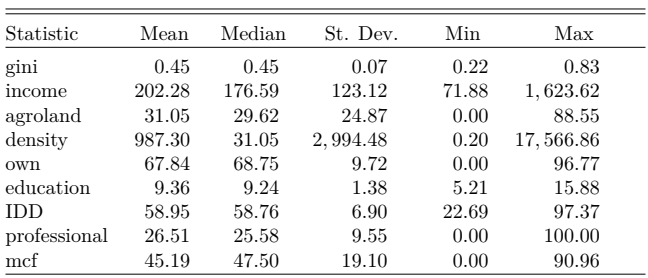
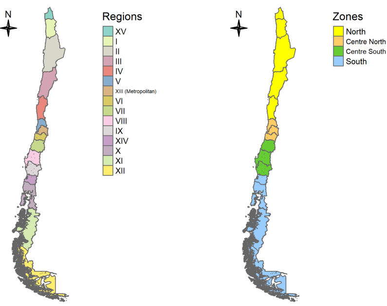

```{r xaringan-themer, include = FALSE}
# library(xaringanthemer)
# mono_accent(base_color = "#252525", link_color	= "rgb(198, 219, 239)")
```

<style>
.onehundredtwenty {
  font-size: 120%;
   }

<style>
.ninety {
  font-size: 90%;
   }

.eightyfive {
  font-size: 85%;
   }
   
.eighty {
  font-size: 80%;
   }
   
.seventyfive {
  font-size: 75%;
   }
   
.seventy {
  font-size: 70%;
   }
</style>


```{r setup, echo = F, include=F}
# include=FALSE
options(htmltools.dir.version = FALSE)

pacman::p_load(tidyverse, xaringan)

knitr::opts_chunk$set(echo = F, warning = F, error = F, message = F)

```


<br>
<br>
<br>
<br>
<br>
<br>
<br>
<br>

.onehundredtwenty[

Research Question:

> What role does income inequality play in explaining differences in municipal efficiency? 

]


---

class: inverse, center, middle

# What do we know about the Link between <br> 

# (Local Government) Efficiency <br> and <br> Income Inequality? 

---

### Theoretical framework

> Pursuing equality can reduce efficiency (the total output produced with given resources).

.center[
<i> See Okun (1975) </i> 
]

--

+ Consequences of *more equal distribution*:
    + Reduce *incentives* to work and invest  
    + Reduce efforts to redistribute 

--

> ...when growth is looked at over the long term, the trade-off between efficiency and equality may not exist. In fact equality appears to be an important ingredient in promoting and sustaining growth.

.center[
<i> See Berg & Ostry (2011) </i> 
]

--

> ...increased gaps in income have led to increased household debt ratios...The only way of sustainably minimising this debt is to reduce income inequality...if income gaps are not reduced, the next crisis will happen as surely as autumn follows summer.

.center[
<i> Kumhof, Michael. IMF economist: Crisis begins with inequality. Interview by Mikael Feldbaum. https://www.eurozine.com, 9 March 2012. </i> 
]

---

## Evidence on Local Government Efficiency (LGE)

--

The interest has been on:

### Measuring LGE `r icon::fa("check")`

--

+ Parametric (SFA) vs non-parametric (DEA) measurement techniques 
+ Provision of single services vs overall efficiency
+ Selection of inputs and outputs (outcomes)
+ Input oriented vs output oriented approach

--

### Explaining differences in LGE  `r icon::fa("check")`

+ Discretionary factors (associated with the measurement process)

--

+ Non-discretionary (contextual) factors
  + Economic - Financial
  + Socio - Demographic
  + Geographic
  + Political - Institutional

---

## How income inequality has been treated?

--

* As an **Output** in the process of measuring efficiency, particularly for the case of European and OECD countries (Afonso, Schuknecht, & Tanzi, 2010; Antonelli & De Bonis, 2018)

--

* As a **Contextual Factor**: 

  + In cross-country comparisons: For instance, more unequal (developing) countries could have higher difficulties to achieve specific health outcomes (Ortega, 2017)

  + At the local level (within specific countries): 

--

      - Higher income inequality could negatively affect municipal efficiency due to competing requirements associated with a more complex set of public services in more unequal municipalities (Jottier, Ashworth, & Heyndels, 2012)

      - When progress is not evenly shared, a persistent within country inequity reduces the effectiveness and efficiency of the public sector (Ortega, Sanjuán, & Casquero, 2017; Tandon, 2005).

---

class: inverse, center, middle


## Data & Methodology


---

### Data

> Sample of 324 municipalities

**Inputs - Output Data used to measure LGE**  

+ National System of Municipal Information, SINIM (2006-2017)
+ In total 3888 observations

--

**County-Level Data on Contextual Factors**

+ National Socioeconomic Characterization Survey, CASEN (2006 - 2009 - 2011 - 2013 - 2015 - 2017)  
+ SINIM
+ "Servicio de Impuestos Internos", SII
+ National Institute of statistics, INE
+ in total 1944 observations

---

## Descriptive Statistics DEA variables

<center>

</center>

---

## Descriptive Statistics Contextual Factors

<center>

</center>

---

class: inverse, center, middle


## Analysis & Results

---
class: center
### Chile: Geographic and Regional Administrative Division 

<center>

</center>

---
class: center

## Results: Returns to Scale by Zone

<center>

</center>

---
class: center

## Efficiency Scores by Zone and Region 
<center>

</center>

---
class: center

## Evolution Efficiency Scores by Zone (Full Period) 

<center>

</center>

---
class: center

### Model Comparisons - Censored Cross-sectional regressions

<center>

</center>

---
class: center

### Model Comparisons - Panel Data
<center>

</center>

---

class: inverse, center, middle

# Conclusions & Future Research

---

## Conclusions

--

### DEA

--

+ The "production function" of municipalities can be described by one showing variable returns to scale.
+ About 3/4 of municipalities shows some degree of ineficiency.
+ The average level of inefficiency is 17%, with higher levels in the Centre area of the country and lower levels in the South.
+ Efficiency shows a ciclical behaviour and, on average, has remained stable in the period 2006 - 2017.

--

### Regression analysis

--

> This paper offers empirical **evidence of a negative relationship
between inequality and efficiency**, that is, a reduction of income inequality (or an increase in equality) could have positive effects on economic efficiency, at least at the level of local governments.


---
class: inverse, center, middle

# Limitations and Future Research

---

## Limitations

--

- Results highly sensitive to measurement technique

--

- External validity

--

- Associated with observational data and causal inference

--

## Future research

--

- To get more causal relationships: 
  + Program evaluation in RCT municipalities.
  + Group municipalities based in some characteristic such as population and conduct RDD.

--

- Given the current situation of the country: What about the issue of **reverse causality?**

---

class: inverse, center, middle


## Thanks for Listening!

---
class:center
### Appendix 1: Inputs and Outputs for DEA

<center>

</center>

---
class:center
### Appendix 2: Contextual factors

<center>

</center>
---
class:center
### Appendix 3: Efficiency Status by Year

<center>

</center>

---
class:center

<center>

</center>